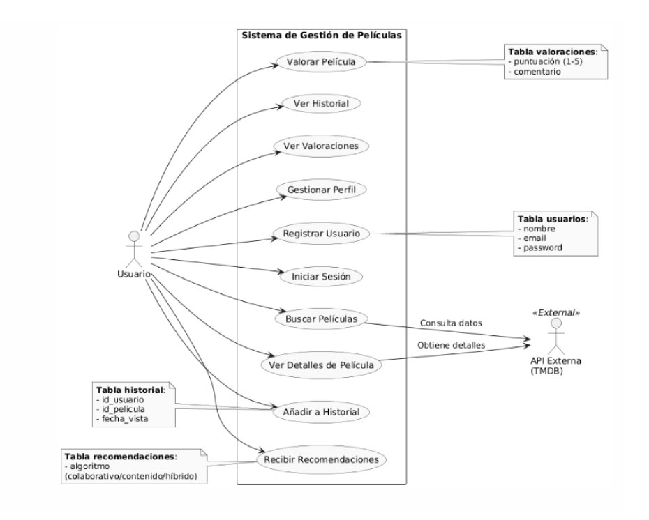
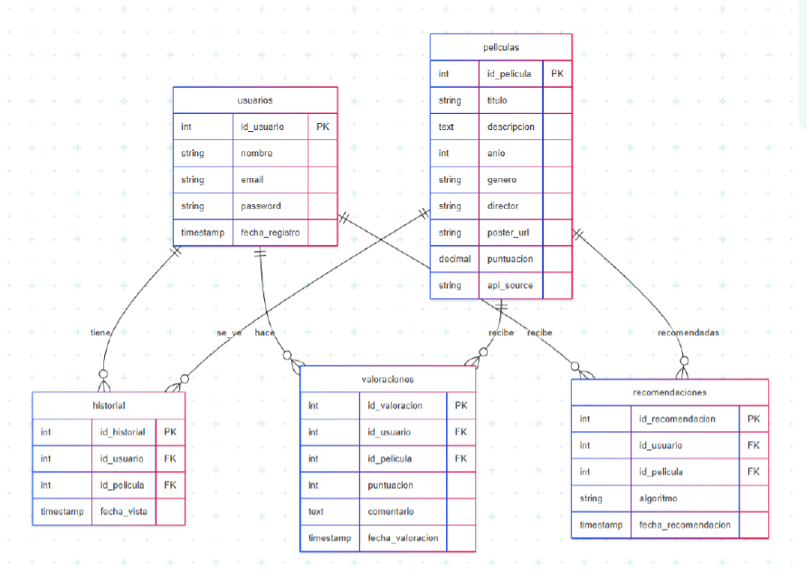
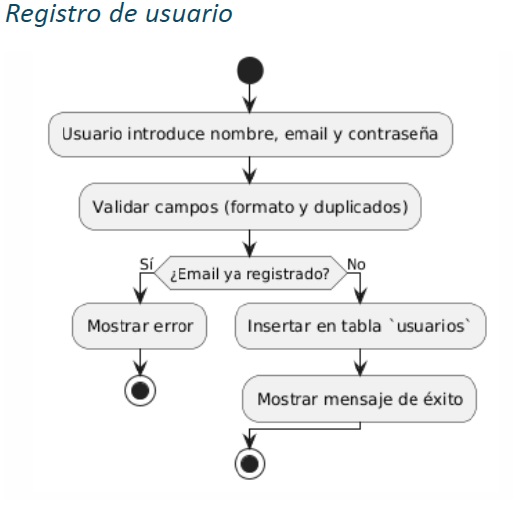
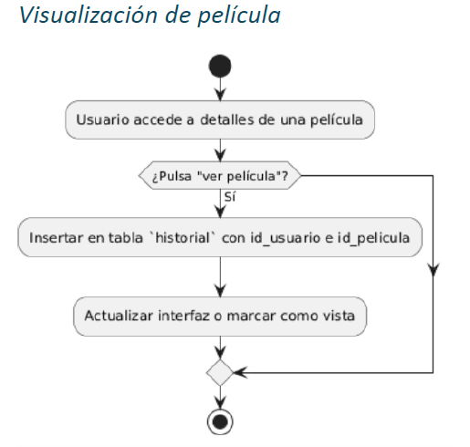
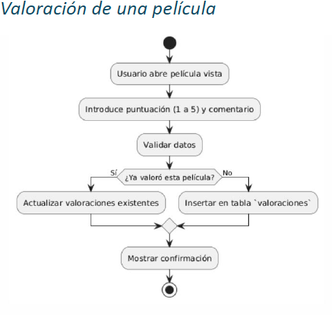
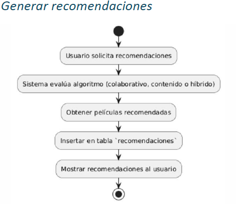
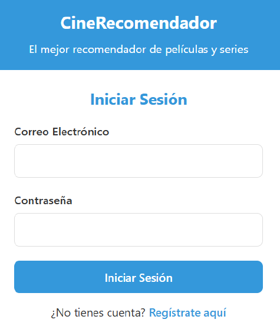
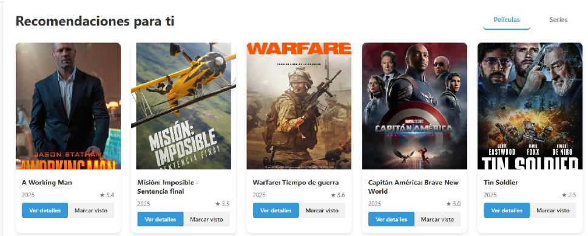
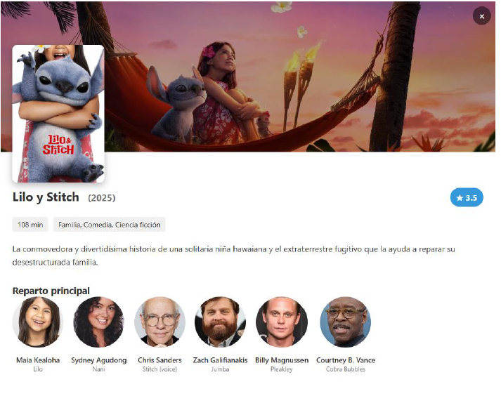
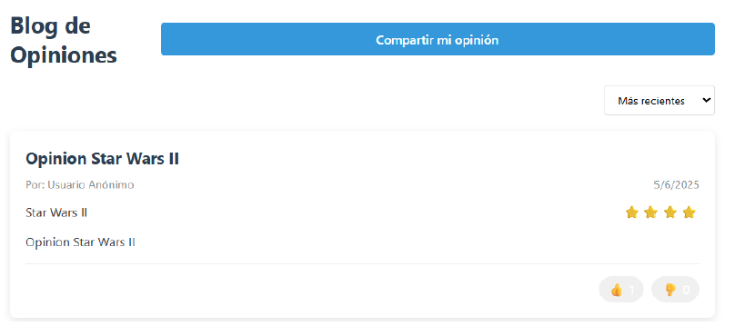

# 🎬 StreamVerse – Movie & TV Recommendation Platform

StreamVerse is a full-stack web application that provides personalized movie and TV series recommendations based on user preferences.

The platform allows users to discover new content, manage their watch history and favorites, and share opinions through an integrated community blog.

This project was developed as my Final Degree Project for the Multiplatform Application Development (DAM) program.

---

# 🚀 Features

- 🔐 User authentication and registration
- 🎯 Personalized recommendations
- ⭐ Favorite and watched lists management
- 🔍 Movie and TV show search
- 📝 Community blog with opinions and ratings
- 👍 Like / dislike system for opinions
- 🎥 Detailed movie information
- 🌐 Integration with external movie API (TMDb)

---

# 🛠 Tech Stack

## Backend
- Java
- Spring Boot
- Spring Security
- REST API
- Maven

## Frontend
- HTML
- CSS
- JavaScript

## Database
- MySQL

## External APIs
- The Movie Database (TMDb)

## Development Tools
- IntelliJ IDEA
- MySQL Workbench
- Postman
- Git

---

# 🏗 System Design

## Use Case Diagram

This diagram shows the main interactions between the user and the system, including authentication, movie search, ratings and recommendations.

---

## Database Schema

The relational database stores users, movies, ratings, watch history and generated recommendations.

---

## Process Flow Diagrams

### User Registration

### Movie Visualization

### Movie Rating

### Recommendation Generation

---

# 🏗 Architecture

The application follows an MVC architecture:

- **Controller layer** → Handles REST API endpoints
- **Service layer** → Business logic and recommendation system
- **Repository layer** → Database access
- **Frontend** → Dynamic UI built with JavaScript

The backend exposes REST endpoints that communicate with the frontend and external APIs.

---

# 📂 Project Structure

src
 └── main
     ├── java
     │   └── com.tfg.recomendador
     │        ├── controller
     │        ├── service
     │        ├── repository
     │        ├── model
     │        └── config
     │
     └── resources
          ├── static
          │    ├── css
          │    ├── js
          │    └── html
          └── application.properties

This project follows a layered architecture separating controllers, services, repositories and models to keep the code modular and maintainable.

---

# 📊 Main Functionalities

## User System
- User registration
- Secure password encryption
- Login / logout
- Session management

## Recommendation System
- Generates recommendations based on user preferences and history
- Displays recommendations in interactive cards

## Lists Management
Users can manage:

- Watched movies
- Favorite movies

## Blog System
Users can:

- Publish opinions
- Like or dislike other opinions
- Filter by popularity or recency

---

# 🔌 API Endpoints

## Authentication
POST /api/auth/register  
Register a new user

## Recommendations
GET /api/recomendaciones/{tipo}

Returns personalized recommendations

Example:

## Movie Search
GET /api/tmdb/buscar?titulo={titulo}

Search movies using TMDb API.

---

# 🗄 Database

The relational database stores:

- Users
- Movies
- Ratings
- Favorites
- Watch history
- Recommendations

---

# 📷 Screenshots

## Login

## Register

## Recommendations

## Movie Details

## Blog

---

# ⚙ Installation

Clone the repository

https://github.com/albertorm005/streamverse-movie-recommender.git

Navigate to the project folder

cd streamverse-movie-recommender

Configure the MySQL database in application.properties

spring.datasource.url=jdbc:mysql://localhost:3306/streamverse
spring.datasource.username=root
spring.datasource.password=yourpassword

Run the application

mvn spring-boot

Open the application in your browser

http://localhost:8081

---

# 🚀 Future Improvements

- Machine learning recommendation algorithms
- Mobile application
- Real-time notifications
- Improved mobile responsive design
- Automated testing and CI/CD

---

# 👨‍💻 Author

**Alberto Rodríguez Martínez**

Junior Software Developer  

Technologies:
Java • Spring Boot • MySQL • REST APIs • JavaScript

GitHub:  
https://github.com/albertorm005